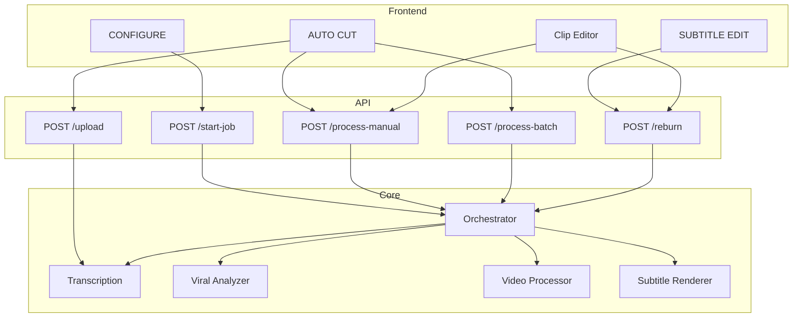
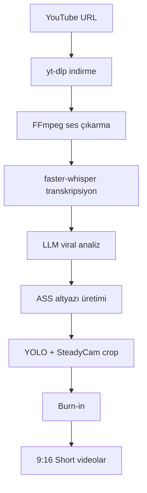

# God-Tier Shorts

**God-Tier Shorts** uzun videolardan tamamen lokal-first, GPU hızlandırmalı, kinetic altyazılı dikey (9:16) kısa videolar (shorts, reels, tiktok) üretmek için tasarlanmış bir otomasyon aracıdır. [faster-whisper](https://github.com/Systran/faster-whisper) transkripsiyonları, YOLO tabanlı akıllı kamera takibi, LLM destekli (OpenRouter/Claude) viral analiz motoru ve React/Vite tabanlı arayüzü tek bir çatı altında birleştirir.

## Özellikler

- **Transkript**: faster-whisper large-v3, kelime düzeyinde zaman damgaları, VRAM optimizasyonu
- **Viral Analiz**: LLM (OpenRouter/Claude veya LM Studio) ile viral segment seçimi
- **Video İşleme**: YOLO11 `track(..., persist=True)` tabanlı kişi takibi, grace/reacquire, shot-cut farkındalığı, 9:16 crop, NVENC hızlandırma
- **Kinetic Altyazı**: ASS stilleri (HORMOZI, TIKTOK vb.), pop/fade animasyonları, süre kontrollü chunking, overflow güvenliği, burn-in
- **Kalite ve Tanı**: `render_metadata` kalite skorları, debug artifact bundle'ı, determinism benchmark scripti
- **Arayüz**: React, Zustand, Tailwind, WebSocket ile gerçek zamanlı job takibi ve clip bazlı kalite özeti

## Hızlı Başlangıç

Desteklenen referans toolchain:
- Python `3.13.x`
- Node.js `22.x`
- npm `10.x`

### Kurulum

```bash
git clone https://github.com/suleymantaha/godtier-shorts.git
cd godtier-shorts

pip install -r requirements.txt
cd frontend && npm install
```

Sürüm pin dosyalari:
- `.python-version` -> `3.13`
- `.nvmrc` -> `22`

Yeni makinede sorunsuz kurulum icin:
[`docs/operations/fresh-install-checklist.md`](docs/operations/fresh-install-checklist.md)

> Not: `POST /api/upload` ve diğer `multipart/form-data` kullanan form/upload endpoint'lerinin çalışması için backend'de `python-multipart` bağımlılığı kurulu olmalıdır (requirements içinde yer alır).

### Ortam Değişkenleri

`.env.example` dosyasını `.env` olarak kopyalayın ve gerekli anahtarları doldurun:

- `OPENROUTER_API_KEY` – Cloud LLM (viral analiz)
- `LMSTUDIO_HOST` – Local LLM (opsiyonel)
- `HF_TOKEN` – HuggingFace (faster-whisper modelleri, opsiyonel)
- `VITE_CLERK_PUBLISHABLE_KEY`, `CLERK_ISSUER_URL`, `CLERK_AUDIENCE` ve `VITE_CLERK_JWT_TEMPLATE` – Clerk auth için gerekli
- `API_BEARER_TOKENS` – Opsiyonel statik token fallback (`token:role1,role2`)
- `PYRE_PYTHON_INTERPRETER` – Opsiyonel, Pyre için interpreter override
- `PYRE_SITE_PACKAGES` – Opsiyonel, Pyre için ek site-packages/search path

Runtime config hardening:
- `API_PORT`, `UPLOAD_MAX_FILE_SIZE`, `REQUEST_BODY_HARD_LIMIT_BYTES`, `SOCIAL_SCHEDULER_*` alanlari pozitif tam sayi olmalidir.
- `REQUEST_BODY_HARD_LIMIT_BYTES`, `UPLOAD_MAX_FILE_SIZE` degerinden kucuk olamaz.
- `FRONTEND_URL`, `CORS_ORIGINS`, `PUBLIC_APP_URL`, `POSTIZ_API_BASE_URL` alanlari mutlak `http(s)` URL olmalidir; query/fragment icermemelidir.

Detayli son kullanici kurulumu ve "bu key'i nereden alacagim?" rehberi:
[`docs/api-key-setup.md`](docs/api-key-setup.md)

### Çalıştırma

```bash
# Tek komutla (backend + frontend)
./run.sh

# veya ayrı ayrı:
python -m backend.main          # Backend: http://0.0.0.0:8000
cd frontend && npm run dev      # Frontend: http://localhost:5173
```

## Sayfa Rehberi

| Sayfa | Açıklama | Dokümantasyon |
|-------|----------|---------------|
| **CONFIGURE** | YouTube URL, stil, job kuyruğu, klip galerisi | [docs/pages/configure](docs/pages/configure.md) |
| **AUTO CUT** | Video yükleme, zaman aralığı, kesim | [docs/pages/auto-cut](docs/pages/auto-cut.md) |
| **SUBTITLE EDIT** | Proje/klip transkript düzenleme | [docs/pages/subtitle-editor](docs/pages/subtitle-editor.md) |
| **Clip Editor** | Kadraj, stil, reburn | [docs/pages/clip-editor](docs/pages/clip-editor.md) |

## İşlem Akışları

| İşlem | Açıklama | Dokümantasyon |
|-------|----------|---------------|
| YouTube Pipeline | URL → indirme → transkripsiyon → viral analiz → klip üretimi | [docs/flows/youtube-pipeline](docs/flows/youtube-pipeline.md) |
| Upload & Transcribe | Video yükleme, hash, transkripsiyon | [docs/flows/upload-transcribe](docs/flows/upload-transcribe.md) |
| Manual Cut | Zaman aralığı veya cut_points ile kesim | [docs/flows/manual-cut](docs/flows/manual-cut.md) |
| Batch Clips | Aralıkta AI ile toplu klip | [docs/flows/batch-clips](docs/flows/batch-clips.md) |
| Reburn | Altyazı yeniden basma (transkript kaydetme dahil) | [docs/flows/reburn](docs/flows/reburn.md) |

## v2.1 Stabilizasyon Notları

- Tracking yalnız `person` sınıfı için çalışır; seçim artık confidence eşiği, birleşik aday skoru, grace/reacquire ve controlled-return kuralları ile yapılır.
- Auto segmentlerde boundary snap, transcript `word_coverage_ratio` değerine göre açılır, daralır veya kapanır.
- Subtitle chunking yalnız kelime sayısına değil süreye de bakar; overflow tespit edilirse önce daha konservatif chunking denenir.
- Pipeline, batch, manual ve reburn çıktıları `render_metadata` altında `tracking_quality`, `transcript_quality`, `audio_validation`, `subtitle_layout_quality`, `debug_timing`, `render_quality_score` ve opsiyonel `debug_artifacts` alanlarını taşıyabilir.
- `DEBUG_RENDER_ARTIFACTS=1` ile `workspace/projects/<project_id>/debug/<clip_stem>/` altına tanı bundle'ı yazılır.
- `python scripts/benchmark_render_stability.py --project ID --clip NAME` ile aynı klip için determinism ve throughput raporu üretilebilir.

## Mimari (Backend Servisleri)

> Not: Subtitle renderer için **tek doğru giriş noktası** `backend/services/subtitle_renderer.py` dosyasıdır.
> Proje kökünde benzer isimli renderer modülü bulunmaz; importlarda yalnızca `backend.services.subtitle_renderer` kullanın.

| Servis | Açıklama | Dokümantasyon |
|--------|----------|---------------|
| Transcription | faster-whisper, kelime zaman damgaları | [docs/architecture/transcription](docs/architecture/transcription.md) |
| Viral Analyzer | LLM viral segment seçimi | [docs/architecture/viral-analyzer](docs/architecture/viral-analyzer.md) |
| Video Processor | YOLO + SteadyCam crop | [docs/architecture/video-processor](docs/architecture/video-processor.md) |
| Subtitle Styles | ASS preset stilleri | [docs/architecture/subtitle-styles](docs/architecture/subtitle-styles.md) |
| Subtitle Renderer | Burn-in | [docs/architecture/subtitle-renderer](docs/architecture/subtitle-renderer.md) |

## Veri Akışı

### Mimari



Her clip için yazılan metadata dosyası artık yalnız transcript ve viral alanlarını değil, kalite kararlarını da taşır:

- `render_metadata.tracking_quality`
- `render_metadata.transcript_quality`
- `render_metadata.audio_validation`
- `render_metadata.subtitle_layout_quality`
- `render_metadata.debug_timing`
- `render_metadata.render_quality_score`
- `render_metadata.debug_artifacts` (`DEBUG_RENDER_ARTIFACTS=1` ise)

### YouTube Pipeline Akışı



## Transkripsiyon Notu

- **Mevcut durum**: Üretimde aktif transkripsiyon motoru `faster-whisper` (large-v3).
- **Hedef durum**: İleride ihtiyaç olursa `WhisperX` tabanlı bir akışa geri dönüş değerlendirilebilir.
- **Geçiş adımları (WhisperX'e dönüş planı)**:
  1. `backend/services/transcription.py` içinde WhisperX pipeline'ını yeniden etkinleştir ve kelime zaman damgası çıktısını mevcut `transcript.json` şemasıyla uyumlu tut.
  2. Orchestrator ve durum mesajlarında `faster-whisper`/`WhisperX` adlandırmalarını tekilleştir (`backend/core/orchestrator.py`, API progress mesajları).
  3. `docs/` ve test fixture'larında terminolojiyi eşleştir, transkripsiyon entegrasyon testlerini WhisperX senaryosu için tekrar çalıştır.

## API Özeti

| Method | Endpoint | Açıklama |
|--------|----------|----------|
| GET | `/api/styles` | Altyazı stilleri |
| POST | `/api/start-job` | YouTube pipeline başlat |
| GET | `/api/jobs` | Job listesi |
| POST | `/api/cancel-job/{id}` | Job iptal |
| GET | `/api/projects` | Proje listesi |
| GET | `/api/clips` | Klip listesi (güvenli clip URL ile) |
| GET | `/api/projects/{project_id}/master` | Proje master videosu (kontrollü erişim) |
| GET | `/api/projects/{project_id}/shorts/{clip_name}` | Shorts altındaki `.mp4/.json` dosyası (kontrollü erişim) |
| POST | `/api/upload` | Video yükleme |
| GET | `/api/transcript` | Proje transkripti |
| POST | `/api/transcript` | Transkript kaydet |
| POST | `/api/process-manual` | Manuel klip render |
| POST | `/api/reburn` | Altyazı yeniden basma |
| POST | `/api/process-batch` | Toplu klip üretimi |
| POST | `/api/manual-cut-upload` | Video + kesim |
| WS | `/ws/progress` | Job ilerleme |

## Auth Kurulum Rehberi

- Clerk entegrasyonu (Dashboard JWT template, `.env`, API/WS doğrulama, troubleshooting):
  [docs/clerk-auth-setup.md](docs/clerk-auth-setup.md)

## Güvenli dosya erişimi

- Doğrudan `/projects` ve `/outputs` static mount erişimi kapalıdır.
- Public klip erişimi yalnızca `/api/projects/{project_id}/shorts/{clip_name}` endpoint'i üzerinden yapılır.
- Master/transcript gibi proje kök dosyaları doğrudan erişime kapalıdır; master için `/api/projects/{id}/master` endpoint'i kullanılır.
- Tüm `/api/*` endpoint'leri kimlik doğrulama ister.
- WebSocket (`/ws/progress`) bağlantısı `?token=<bearer>` query param ile yetkilendirilir.

## Testler

```bash
# Tam kalite kapisi
bash scripts/verify.sh

# Sadece toolchain dogrulamasi
python scripts/check_toolchain.py

# Sadece runtime config dogrulamasi
python scripts/check_runtime_config.py

# Sistem bagimliliklari (ffmpeg / yt-dlp / opsiyonel GPU)
python scripts/check_system_deps.py
python scripts/check_system_deps.py --require-gpu

# Backend
pytest backend/tests -v
pytest backend/tests -v -m "not integration"

# Frontend
cd frontend && npm run test
cd frontend && npm run verify

# Determinism / throughput
python scripts/benchmark_render_stability.py --project ID --clip NAME --runs 3 --samples 5
```

`bash scripts/verify.sh` kanonik tam dogrulama komutudur; toolchain check + runtime config check + frontend `lint + test + build` ile backend `pytest backend/tests -q` adimlarini fail-fast kosar. `python scripts/check_system_deps.py` ise yeni makine hazirligi ve medya pipeline bagimliliklari icin ayrica kosulmalidir.

Pyre statik analiz (opsiyonel):

```bash
scripts/run_pyre.sh
# veya env ile:
PYRE_PYTHON_INTERPRETER=/path/to/python \
PYRE_SITE_PACKAGES=/path/to/site-packages \
scripts/run_pyre.sh
```

**Scripts:** `scripts/README.md` – reburn_clip, test_subtitle_styles vb.

## Katkı

Pull Request göndererek destek olabilirsiniz.

---

_Bu proje, video içerik üreticileri için tam donanımlı ve yerel makinede maksimum performans sağlamak amacıyla üretilmiştir._
