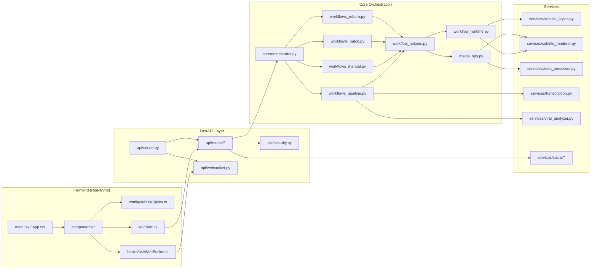
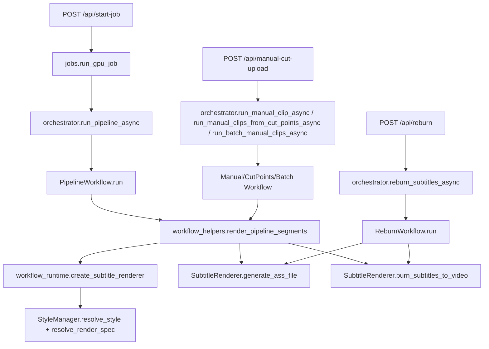
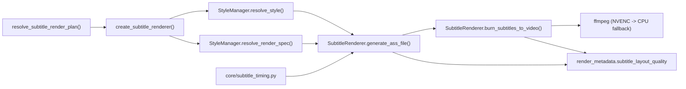
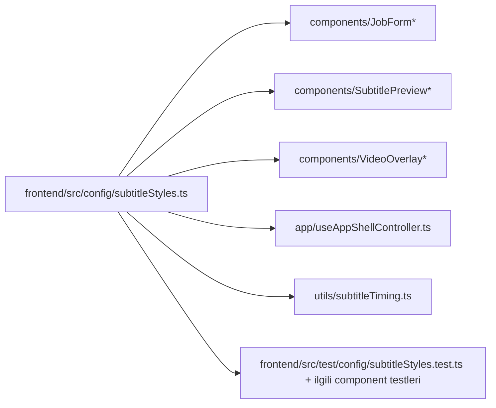
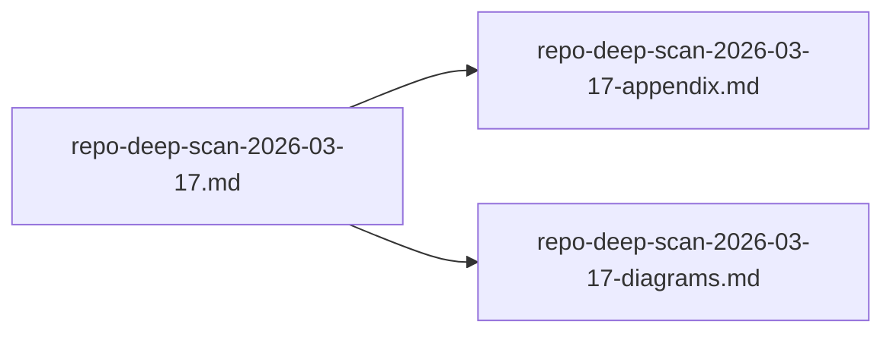

# Repo Deep Scan Diagrams (2026-03-17)

Bu dosya, `repo-deep-scan-2026-03-17.md` raporunun görsel karşılığıdır.

## 1) Katmanlı Sistem Mimarisi

## 2) Endpoint -> Workflow -> Render Zinciri

## 3) Subtitle Pipeline Fonksiyon Bağımlılık Haritası

## 4) Frontend Subtitle Konfigürasyon Etki Grafiği

## 5) Tarama Artifact İlişkisi

