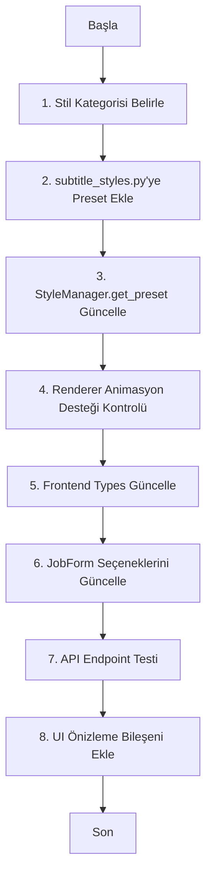

# Altyazı Sistemi Genişletme Rehberi

## 📋 Mevcut Durum Analizi

### 1. Mevcut Altyazı Yapısı

#### [`subtitle_styles.py`](backend/services/subtitle_styles.py) - Veri Modeli

```python
class SubtitleStyle(BaseModel):
    name: str            # Stil adı
    font_name: str       # Font ailesi
    font_size: int       # Font boyutu (piksel)
    primary_color: str   # ASS hex format: &H00RRGGBB
    highlight_color: str # Vurgulama rengi
    outline_color: str   # Kontur rengi
    outline_width: float # Kontur kalınlığı
    shadow_color: str    # Gölge rengi
    shadow_depth: float  # Gölge derinliği
    alignment: int       # 1-9 arası konum (5=orta)
    margin_v: int        # Dikey marjin
    animation_type: str  # Animasyon türü: pop|fade|slide_up|none
```

**Mevcut Presetler:**
| Anahtar | Font | Boyut | Özellik |
|---------|------|-------|---------|
| `HORMOZI` | Montserrat Black | 120px | Pop animasyonu, güçlü kontur |
| `MRBEAST` | Komika Axis | 130px | Parlak yeşil vurgu, üst konum |
| `MINIMALIST` | Helvetica Neue | 18px | Fade animasyon, sade tasarım |

#### [`subtitle_renderer.py`](backend/services/subtitle_renderer.py) - İşleme Motoru

```
┌─────────────────────────────────────────────────────────────┐
│                   SubtitleRenderer                          │
├─────────────────────────────────────────────────────────────┤
│  • generate_ass_file()   → WhisperX JSON'dan ASS üretir   │
│  • burn_subtitles_to_video() → FFmpeg ile video'ya yakar  │
│  • _smart_chunking()     → Kelime gruplama algoritması    │
│  • _calculate_animation_tags() → Karaoke efekt hesabı      │
└─────────────────────────────────────────────────────────────┘
```

---

## 🎯 Yeni Altyazı Türleri Eklenmesi

### 2. Veri Modeli Genişletme

#### 2.1 Stil Kategorileri

Yeni altyazı türleri için önerilen kategori yapısı:

```python
from enum import Enum

class SubtitleCategory(str, Enum):
    """Altyazı kategorileri"""
    DYNAMIC = "dynamic"      # Dinamik/enerjik (mevcut HORMOZI, MRBEAST)
    MINIMAL = "minimal"      # Minimal/sade (mevcut MINIMALIST)
    CREATIVE = "creative"   # Yaratıcı/özelleştirilmiş
    ACCESSIBLE = "accessible" # Erişilebilirlik odaklı
    CORPORATE = "corporate"  # Kurumsal/profesyonel
```

#### 2.2 Yeni Alanlar

[`subtitle_styles.py`](backend/services/subtitle_styles.py) dosyasına eklenecek alanlar:

```python
class SubtitleStyle(BaseModel):
    # ... mevcut alanlar ...

    # --- YENİ ALANLAR ---
    category: SubtitleCategory = Field(default=SubtitleCategory.DYNAMIC)

    # Font geliştirmeleri
    font_weight: int = Field(default=700)        # 100-900 arası kalınlık
    italic: bool = Field(default=False)
    underline: bool = Field(default=False)

    # Renk paleti (gradient desteği için)
    gradient_colors: list[str] = Field(default_factory=lambda: ["&H00FFFFFF"])
    gradient_direction: str = Field(default="none")  # none|horizontal|vertical

    # Konum hassasiyeti
    position_x: float = Field(default=0.5, ge=0.0, le=1.0)  # %0-100
    position_y: float = Field(default=0.9, ge=0.0, le=1.0)

    # Efektler
    blur: float = Field(default=0.0)
    border_radius: float = Field(default=0.0)
    background_color: str = Field(default="&H00000000")  # Şeffaf

    # Animasyon detayları
    animation_duration: float = Field(default=0.15)  # Saniye
    animation_easing: str = Field(default="ease-out")

    # Erişilebilirlik
    high_contrast: bool = Field(default=False)
    large_text: bool = Field(default=False)
```

---

### 3. Yeni Stil Tanımlamaları

#### 3.1 Preset Eklenmesi

[`subtitle_styles.py`](backend/services/subtitle_styles.py) dosyasındaki `_PRESETS` sözlüğüne yeni stiller ekleyin:

```python
"TIKTOK": SubtitleStyle(
    name="TikTok Vertical",
    category=SubtitleCategory.DYNAMIC,
    font_name="Montserrat Black",
    font_size=140,
    primary_color="&H00FFFFFF",
    highlight_color="&H00FF00FF",  # TikTok cyan/magenta
    gradient_colors=["&H00FFFFFF", "&H00FF00FF"],
    gradient_direction="horizontal",
    outline_width=8.0,
    shadow_depth=3.0,
    alignment=2,  # Alt sol
    margin_v=250,
    position_y=0.85,
    animation_type="pop",
    animation_duration=0.12,
),
"YOUTUBE_SHORT": SubtitleStyle(
    name="YouTube Shorts",
    category=SubtitleCategory.DYNAMIC,
    font_name="Poppins Bold",
    font_size=110,
    primary_color="&H00FFFFFF",
    highlight_color="&H0000FFFF",
    outline_width=10.0,
    shadow_depth=4.0,
    alignment=2,
    margin_v=280,
    animation_type="pop",
    background_color="&H80000000",  # Yarı siyah arka plan
    border_radius=8.0,
),
"PODCAST": SubtitleStyle(
    name="Podcast Style",
    category=SubtitleCategory.MINIMAL,
    font_name="Inter",
    font_size=32,
    primary_color="&H00F0F0F0",
    highlight_color="&H00FFFFFF",
    outline_width=0.0,
    shadow_depth=2.0,
    shadow_color="&H80000000",
    alignment=5,  # Orta
    margin_v=200,
    animation_type="fade",
    animation_duration=0.3,
    background_color="&H40000000",
    border_radius=4.0,
),
"CORPORATE": SubtitleStyle(
    name="Kurumsal",
    category=SubtitleCategory.CORPORATE,
    font_name="Roboto",
    font_size=36,
    font_weight=500,
    primary_color="&H00FFFFFF",
    outline_width=2.0,
    outline_color="&H00000000",
    shadow_depth=1.0,
    alignment=5,
    margin_v=180,
    animation_type="fade",
    animation_duration=0.5,
),
"HIGHCARE": SubtitleStyle(
    name="Yüksek Kontrast",
    category=SubtitleCategory.ACCESSIBLE,
    font_name="Arial Black",
    font_size=48,
    font_weight=900,
    primary_color="&H00FFFF00",  # Sarı
    highlight_color="&H00FFFFFF",
    outline_width=4.0,
    outline_color="&H00000000",
    shadow_depth=0.0,
    high_contrast=True,
    alignment=5,
    margin_v=150,
    animation_type="none",
),
```

#### 3.2 Stil Fabrika Metodu

```python
@classmethod
def create_custom_style(
    cls,
    name: str,
    font_name: str = "Arial",
    font_size: int = 36,
    primary_color: str = "&H00FFFFFF",
    category: SubtitleCategory = SubtitleCategory.CREATIVE,
    **kwargs
) -> SubtitleStyle:
    """Özel stil oluşturucu fabrika metodu."""
    return SubtitleStyle(
        name=name,
        font_name=font_name,
        font_size=font_size,
        primary_color=primary_color,
        category=category,
        **kwargs
    )
```

---

### 4. Renderer Güncellemeleri

#### 4.1 ASS Header Güncelleme

[`subtitle_renderer.py`](backend/services/subtitle_renderer.py) dosyasında `_generate_ass_header()` metodunu güncelleyin:

```python
def _generate_ass_header(self) -> str:
    s = self.style
    return f"""[Script Info]
ScriptType: v4.00+
PlayResX: 1080
PlayResY: 1920
WrapStyle: 1
[V4+ Styles]
Format: Name, Fontname, Fontsize, PrimaryColour, SecondaryColour, OutlineColour, BackColour, Bold, Italic, Underline, StrikeOut, ScaleX, ScaleY, Spacing, Angle, BorderStyle, Outline, Shadow, Alignment, MarginL, MarginR, MarginV, Encoding
Style: Main,{s.font_name},{s.font_size},{s.primary_color},&H000000FF,{s.outline_color},{s.shadow_color},{-1 if s.font_weight >= 700 else 0},{1 if s.italic else 0},{1 if s.underline else 0},0,100,100,0,0,1,{s.outline_width},{s.shadow_depth},{s.alignment},10,10,{s.margin_v},1

[Events]
Format: Layer, Start, End, Style, Name, MarginL, MarginR, MarginV, Effect, Text
"""
```

#### 4.2 Gradient Destekli Animasyon

```python
def _calculate_animation_tags(self, word_start: float, word_end: float, chunk_start: float, chunk_end: float) -> str:
    """Gradient ve gelişmiş efektlerle animasyon hesaplayıcı."""
    if self.style.animation_type == "none":
        return ""

    relative_start_ms = max(0, int((word_start - chunk_start) * 1000))
    relative_end_ms = max(0, int((word_end - chunk_start) * 1000))

    if relative_end_ms <= relative_start_ms:
        relative_end_ms = relative_start_ms + 100

    pop_duration = min(150, relative_end_ms - relative_start_ms)
    if pop_duration < 100:
        pop_duration = 150
    pop_end_ms = relative_start_ms + pop_duration

    # Gradient renk geçişi
    if len(self.style.gradient_colors) > 1:
        gradient_tag = self._generate_gradient_tags(relative_start_ms)
    else:
        gradient_tag = ""

    if self.style.animation_type == "pop":
        c_hi = self.style.highlight_color
        c_pri = self.style.primary_color
        init = r"{\fscx80\fscy80}"
        active = fr"{{\t({relative_start_ms},{relative_start_ms+10},\c{c_hi}\fscx140\fscy140)}}"
        post = fr"{{\t({pop_end_ms},{pop_end_ms+100},\c{c_pri}\fscx100\fscy100)}}"
        return init + gradient_tag + active + post
    # ... diğer animasyonlar
```

#### 4.3 Arka Plan ve Border Radius

```python
def _generate_background_tags(self) -> str:
    """Arka plan ve köşe yuvarlama için ASS tag'leri."""
    tags = []

    if self.style.background_color != "&H00000000":
        # Arka plan rengi (1 = düz dolgu)
        tags.append(r"{\1c" + self.style.background_color + r"}")

    if self.style.border_radius > 0:
        # ASS'de doğrudan border radius yok, bunun yerine
        # clip veya mask kullanılabilir - sınırlı destek
        pass

    return "".join(tags)
```

---

### 5. UI Bileşenleri

#### 5.1 Frontend Tip Tanımlamaları

[`frontend/src/types/index.ts`](frontend/src/types/index.ts) dosyasına eklenecekler:

```typescript
export type SubtitleCategory =
  | "dynamic"
  | "minimal"
  | "creative"
  | "accessible"
  | "corporate";

export interface SubtitleStyleConfig {
  name: string;
  category: SubtitleCategory;
  fontName: string;
  fontSize: number;
  primaryColor: string;
  highlightColor: string;
  outlineColor: string;
  outlineWidth: number;
  shadowColor: string;
  shadowDepth: number;
  alignment: number;
  marginV: number;
  animationType: "pop" | "fade" | "slide_up" | "none";
  // Yeni alanlar
  gradientColors?: string[];
  gradientDirection?: "none" | "horizontal" | "vertical";
  backgroundColor?: string;
  borderRadius?: number;
  positionX?: number;
  positionY?: number;
  fontWeight?: number;
  italic?: boolean;
  highContrast?: boolean;
}
```

#### 5.2 JobForm Güncellemesi

[`frontend/src/components/JobForm.tsx`](frontend/src/components/JobForm.tsx) için önerilen güncelleme:

```tsx
const SUBTITLE_STYLES = [
  { value: "HORMOZI", label: "Hormozi (Dynamic)", category: "dynamic" },
  { value: "MRBEAST", label: "MrBeast (Gaming)", category: "dynamic" },
  { value: "TIKTOK", label: "TikTok Style", category: "dynamic" },
  { value: "YOUTUBE_SHORT", label: "YouTube Shorts", category: "dynamic" },
  { value: "MINIMALIST", label: "Minimalist", category: "minimal" },
  { value: "PODCAST", label: "Podcast", category: "minimal" },
  { value: "CORPORATE", label: "Kurumsal", category: "corporate" },
  { value: "HIGHCARE", label: "Yüksek Kontrast", category: "accessible" },
];

// Stil önizleme bileşeni ekle
const StylePreview: React.FC<{ style: string }> = ({ style }) => {
  const styleConfig = SUBTITLE_STYLES.find((s) => s.value === style);
  return (
    <div className="style-preview p-4 rounded-lg bg-card border">
      <span className={`text-${styleConfig?.category}`}>
        {styleConfig?.label}
      </span>
    </div>
  );
};
```

#### 5.3 Stil Önizleme Bileşeni

[`frontend/src/components/SubtitleStylePreview.tsx`](frontend/src/components/SubtitleStylePreview.tsx) oluşturun:

```tsx
import React from "react";
import { SubtitleStyleConfig } from "../types";

interface Props {
  style: SubtitleStyleConfig;
  sampleText?: string;
}

export const SubtitleStylePreview: React.FC<Props> = ({
  style,
  sampleText = "Örnek Altyazı Metni",
}) => {
  const previewStyle: React.CSSProperties = {
    fontFamily: style.fontName,
    fontSize: `${Math.min(style.fontSize / 3, 40)}px`, // Önizleme için küçült
    color: style.primaryColor.replace("&H00", "#").replace("&H", "#"),
    textShadow: `
      ${style.outlineWidth}px ${style.outlineWidth}px 0 ${style.outlineColor.replace("&H00", "#").replace("&H", "#")},
      -${style.outlineWidth}px -${style.outlineWidth}px 0 ${style.outlineColor.replace("&H00", "#").replace("&H", "#")},
      ${style.shadowDepth}px ${style.shadowDepth}px ${style.shadowDepth * 2}px ${style.shadowColor.replace("&H00", "#").replace("&H", "#")}
    `,
    backgroundColor: style.backgroundColor
      ?.replace("&H00", "#")
      .replace("&H", "#")
      .replace("80", "50"),
    borderRadius: style.borderRadius ? `${style.borderRadius / 10}px` : "0",
    padding: "8px 16px",
    textAlign:
      style.alignment <= 3 ? "left" : style.alignment >= 7 ? "right" : "center",
  };

  return (
    <div className="subtitles-preview-container p-4 border rounded-lg">
      <div style={previewStyle}>{sampleText}</div>
    </div>
  );
};
```

---

### 6. Veritabanı ve Schema Değişiklikleri

#### 6.1 API Schema Güncellemesi

[`backend/models/schemas.py`](backend/models/schemas.py) dosyasına eklenecekler:

```python
class SubtitleStyleRequest(BaseModel):
    """Altyazı stili oluşturma/güncelleme isteği."""
    name: str = Field(..., min_length=1, max_length=50)
    category: SubtitleCategory = Field(default=SubtitleCategory.CREATIVE)
    font_name: str = Field(default="Arial")
    font_size: int = Field(default=36, ge=8, le=500)
    font_weight: int = Field(default=700, ge=100, le=900)
    primary_color: str = Field(default="&H00FFFFFF")
    highlight_color: str = Field(default="&H0000FFFF")
    outline_color: str = Field(default="&H00000000")
    outline_width: float = Field(default=2.0, ge=0, le=20)
    shadow_color: str = Field(default="&H80000000")
    shadow_depth: float = Field(default=1.5, ge=0, le=20)
    alignment: int = Field(default=5, ge=1, le=9)
    margin_v: int = Field(default=150, ge=0, le=1000)
    animation_type: str = Field(default="pop")
    animation_duration: float = Field(default=0.15, ge=0, le=2.0)
    gradient_colors: list[str] = Field(default_factory=lambda: ["&H00FFFFFF"])
    gradient_direction: str = Field(default="none")
    background_color: str = Field(default="&H00000000")
    border_radius: float = Field(default=0.0)
    position_x: float = Field(default=0.5, ge=0.0, le=1.0)
    position_y: float = Field(default=0.9, ge=0.0, le=1.0)
    high_contrast: bool = Field(default=False)

class JobRequest(BaseModel):
    # ... mevcut alanlar ...
    custom_style: Optional[SubtitleStyleRequest] = Field(
        default=None,
        description="Özel stil tanımı (preset yerine)"
    )
```

#### 6.2 API Endpoint'leri

[`backend/api/routes/styles.py`](backend/api/routes/styles.py) (yeni dosya):

```python
from fastapi import APIRouter, HTTPException
from typing import List
from backend.services.subtitle_styles import StyleManager, SubtitleStyle
from backend.models.schemas import SubtitleStyleRequest

router = APIRouter(prefix="/api/styles", tags=["styles"])

@router.get("/presets")
async def list_presets():
    """Mevcut presetleri listele."""
    return {
        "presets": StyleManager.list_presets(),
        "details": {k: v.model_dump() for k, v in StyleManager._PRESETS.items()}
    }

@router.get("/presets/{preset_name}")
async def get_preset(preset_name: str):
    """Belirli bir presetin detaylarını getir."""
    style = StyleManager.get_preset(preset_name)
    return style.model_dump()

@router.post("/custom")
async def create_custom_style(style: SubtitleStyleRequest):
    """Özel stil oluştur (veritabanına kaydet)."""
    # TODO: Veritabanı entegrasyonu
    return {"status": "created", "style": style.name}
```

---

### 7. Best Practices ve Adım Adım Rehber

#### 7.1 Yeni Altyazı Türü Ekleme Adımları



#### 7.2 Stil Kategorisi Önerileri

| Kategori       | Kullanım Senaryosu            | Önerilen Font       | Animasyon    |
| -------------- | ----------------------------- | ------------------- | ------------ |
| **Dynamic**    | TikTok, Reels, YouTube Shorts | Bold, dikkat çekici | Pop, slide   |
| **Minimal**    | Podcast, Vlog, Eğitim         | Sans-serif, temiz   | Fade         |
| **Creative**   | Özel marka, viral içerik      | Özel font           | Karmaşık     |
| **Accessible** | Eğitim, haber, geniş kitleler | High contrast       | Yok/düşük    |
| **Corporate**  | Kurumsal video, tanıtım       | Serif/sans-serif    | Fade, subtle |

#### 7.3 Renk Formatı Açıklamaları

```
ASS Renk Formatı: &HAABBGGRR veya &H00RRGGBB

Örnekler:
• &H00FFFFFF = Beyaz (en yaygın)
• &H00000000 = Siyah
• &H00FFFF00 = Sarı
• &H0000FFFF = Cyan
• &H00FF00FF = Magenta
• &H0000FF00 = Yeşil
• &H00FF0000 = Kırmızı
• &H000000FF = Mavi

Alpha (şeffaflık) için 80-FF kullan:
• &H80FFFFFF = %50 şeffaf beyaz
• &HC0FFFFFF = %75 şeffaf beyaz
```

#### 7.4 Alignment Değerleri

```
  7 8 9    →  Sol-Orta-Sağ Üst
  4 5 6    →  Sol-Orta-Sağ Orta
  1 2 3    →  Sol-Orta-Sağ Alt

En yaygın kullanılanlar:
• 5 = Tam orta (varsayılan)
• 2 = Alt orta (YouTube Shorts/TikTok)
• 7 = Üst orta
```

#### 7.5 Test Kontrol Listesi

- [ ] Yeni preset ile ASS dosyası oluşturuluyor mu?
- [ ] Font yüklemesi başarılı mı?
- [ ] Renkler doğru görünüyor mu?
- [ ] Animasyon akıcı mı?
- [ ] Video burn-in işlemi başarılı mı?
- [ ] Frontend'de önizleme doğru gösteriliyor mu?
- [ ] Farklı çözünürlüklerde (1080x1920, 1080x1080) test edildi mi?

---

## 📌 Hızlı Başvuru

### Dosya Yapısı

```
backend/
├── services/
│   ├── subtitle_styles.py      # ✅ Stil tanımları - Presetleri buraya ekle
│   └── subtitle_renderer.py    # 🔄 Renderer - Animasyonları güncelle
├── models/
│   └── schemas.py              # 🔄 API şemaları - Yeni alanları ekle
└── api/
    └── routes/
        └── styles.py            # 🆕 Yeni endpoint (opsiyonel)

frontend/
└── src/
    ├── types/
    │   └── index.ts             # 🔄 TypeScript tipleri
    ├── components/
    │   ├── JobForm.tsx          # 🔄 Stil seçimi dropdown
    │   └── SubtitlePreview.tsx   # 🆕 Önizleme bileşeni
    └── api/
        └── client.ts            # 🔄 Stil endpoint çağrıları
```

### Sonraki Adımlar

1. **Öncelik 1**: [`subtitle_styles.py`](backend/services/subtitle_styles.py) dosyasına 3-5 yeni preset ekleyin
2. **Öncelik 2**: [`subtitle_renderer.py`](backend/services/subtitle_renderer.py) gradient desteğini ekleyin
3. **Öncelik 3**: Frontend tip tanımlarını güncelleyin
4. **Öncelik 4**: JobForm'a yeni stilleri ekleyin
5. **Öncelik 5**: Önizleme bileşeni oluşturun

---

_Bu rehber godtier-shorts projesi için hazırlanmıştır._
_Tarih: 2026-03-07_
