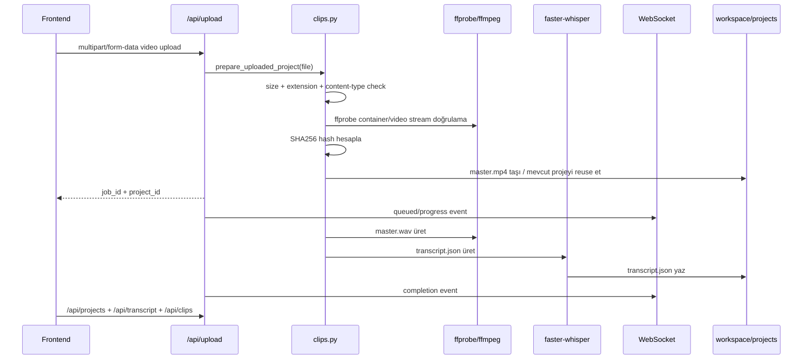

# GodTier Shorts Teknik Denetim Raporu

**Tarih:** 13 Mart 2026  
**Kapsam:** `godtier-shorts` repo içi backend, frontend, testler, dokümantasyon, runtime workspace modeli ve harici entegrasyon yüzeyi olarak `/home/arch/postiz-docker-compose/docker-compose.yaml`  
**Metodoloji:** statik kod/doküman incelemesi + hedefli ölçüm + test/lint doğrulaması  
**Not:** Uygulama kodu değiştirilmedi; yalnızca rapor artefaktları üretildi.

## 1. Yönetici Özeti

GodTier Shorts bugünkü haliyle **lokal-first, GPU-yoğun bir modüler monolit**. Bu tercih mevcut kullanım senaryosu için mantıklı: tek makine, tek GPU, dosya-temelli proje saklama ve düşük orkestrasyon maliyeti. FastAPI arka ucu, React/Vite ön yüzü ve dosya sistemi tabanlı `workspace/` düzeni birlikte çalışıyor; medya iş hattı gerçek ortamda hızlı ve işlevsel.

En güçlü taraflar:

- Backend tarafında route, workflow ve servis ayrımı önceki sürümlere göre daha net.
- Güvenli dosya erişimi için sanitize/whitelist yaklaşımı uygulanmış.
- Clip index cache, transcript/audio reuse ve hash tabanlı upload dedup mevcut.
- Test tabanı işlevsel: backend’de 83 testten 81’i geçti, frontend’de 69 test geçti.
- Çalışma istasyonunda CUDA ve NVENC aktif; 8 saniyelik reburn yaklaşık 2 saniyede tamamlanıyor.

En kritik risk kümeleri:

1. **Harici Postiz/Temporal compose yüzeyi** düz metin sırlar, açık kayıt ve genişletilmiş servis yüzeyi içeriyor.
2. **Upload sınırı ve disk baskısı** hâlâ tam anlamıyla akış seviyesinde çözülmüş değil; büyük yükler önce spool edilip sonra doğrulanıyor.
3. **Secret ve credential yönetimi** sosyal yayın akışında zayıf varsayılanlara dayanıyor.
4. **Bağımlılık ve çalışma zamanı drift’i** (`requirements.txt`, Python 3.10/3.13 farkı, WhisperX/faster-whisper terminoloji kayması) taze kurulum ve operasyonel doğruluk riskini artırıyor.
5. **Karmaşıklık bütçesi aşımı** artık ölçülebilir: backend guardrail testi kırılıyor, frontend lint 35 uyarı üretiyor.

Önceki 12 Mart 2026 raporuna göre doğrulanmış iyileşmeler:

- `backend/api/server.py:78-109` artık güvenlik header’ları ekliyor.
- `backend/config.py:123-130` artık `API_HOST` ve `API_PORT` değerlerini environment’tan okuyor.
- WebSocket istemcisi artık subprotocol kullanıyor; query-string token desteği yalnızca backend fallback olarak duruyor.

## 2. Sistem Sınıflandırması ve Teknoloji Envanteri

### 2.1 Mimari Sınıf

- **Temel uygulama modeli:** modüler monolit
- **Backend süreç modeli:** tek FastAPI süreci + process içi job registry + tek GPU lock
- **Saklama modeli:** ana medya ve proje çıktıları yerel dosya sisteminde, sosyal yayın verisi SQLite’ta
- **Harici servisler:** Postiz Public API, Clerk JWKS/JWT, LLM sağlayıcısı, ffmpeg, yt-dlp
- **Mesajlaşma modeli:** mesaj kuyruğu yok; event akışı callback + WebSocket + scheduler polling ile sağlanıyor

Bu seçim, tek makine/tek GPU odaklı ürün için doğru; ancak çok kullanıcılı veya yatay ölçekli dağıtıma doğal olarak taşınmıyor.

### 2.2 Teknoloji Envanteri

| Katman | Teknoloji | Gözlenen Durum | Değerlendirme |
|---|---|---|---|
| Backend runtime | Python | Çalışan sürüm `3.13.11`, Pyre hedefi `3.10` | Çalışıyor ama sürüm drift’i var |
| Web/API | FastAPI + Uvicorn | `requirements.txt` ile tanımlı | Uyumlu |
| Doğrulama | Pydantic v2 | `backend/models/schemas.py` ve `backend/api/schemas.py` | Uyumlu |
| Loglama | Loguru | API, orchestrator ve servislerde aktif | Fazla DEBUG ağırlıklı |
| Transkripsiyon | `faster-whisper` | Gerçek motor aktif | Çalışıyor, isimlendirme drift’i var |
| Video işleme | FFmpeg + NVENC + OpenCV + Ultralytics YOLO | CUDA/NVENC aktif | Güçlü ama GPU bağımlı |
| LLM analizi | OpenAI SDK tabanlı adaptörler | OpenRouter/LM Studio seçenekli | Uyumlu |
| Frontend | React 19 + Vite 7 + TypeScript 5.9 | Çalışıyor | Modern ama büyük bileşenler var |
| State | Zustand | Job/theme store kullanılıyor | Yeterli |
| Auth UI | Clerk React | JWT token injection ile kullanılıyor | Backend auth ile uyumlu |
| Stil | Tailwind CSS 4 + Framer Motion | Aktif | Uyumlu |
| Sosyal yayın | Postiz client + SQLite store + scheduler | Repo içinde entegre | Operasyonel yüzeyi geniş |

### 2.3 Uyumluluk Notları

- **FastAPI + Pydantic v2** tarafında yapısal bir uyumsuzluk görünmüyor.
- **React 19 + Vite 7 + Clerk 5 + Zustand 5** kombinasyonu düzgün çalışıyor.
- **Python çalışma zamanı drift’i** var: Pyre yapılandırması `3.10`, testler `3.13.11` üzerinde çalıştı. Tip kontrolünde ve bağımlılık çözümünde “çalışıyor ama belgelenmemiş” bir boşluk oluşuyor.
- **Backend manifest eksikliği** var: `backend/api/security.py:13-14` ve `backend/services/social/crypto.py:9` import ettiği `PyJWT` ve `cryptography`, `requirements.txt` içinde listelenmiyor.

## 3. Mimari Topoloji ve Veri Akışı

### 3.1 Bileşen Topolojisi

```mermaid
flowchart LR
    subgraph UI[Frontend SPA]
        App[App.tsx]
        Pages[Configure / Auto Cut / Subtitle Edit / Clip Editor]
        Stores[Zustand Stores]
        WS[useWebSocket]
        APIClient[api/client.ts]
    end

    subgraph API[FastAPI]
        Jobs[jobs routes]
        Clips[clips routes]
        Editor[editor routes]
        Social[social routes]
        WSAPI[/ws/progress]
    end

    subgraph Core[Orchestration]
        Orch[GodTierShortsCreator]
        WF[Workflow classes]
        Queue[manager.jobs + gpu_lock]
    end

    subgraph Services[Domain Services]
        Transcribe[transcription.py]
        Viral[viral_analyzer.py]
        Video[video_processor.py]
        Subtitle[subtitle_renderer.py]
        SocialSvc[social/*.py]
    end

    subgraph Storage[Local Storage]
        Projects[workspace/projects/*]
        Metadata[workspace/metadata/*]
        Logs[workspace/logs/*]
        SocialDB[social_publish.db]
    end

    subgraph External[External Systems]
        FFmpeg[ffmpeg + NVENC]
        YTDLP[yt-dlp]
        Clerk[Clerk JWT/JWKS]
        LLM[OpenRouter / LM Studio]
        Postiz[Postiz Public API]
        Temporal[Temporal stack]
    end

    App --> Pages --> APIClient
    App --> Stores
    App --> WS
    APIClient --> Jobs
    APIClient --> Clips
    APIClient --> Editor
    APIClient --> Social
    WS --> WSAPI

    Jobs --> Queue --> Orch
    Clips --> Orch
    Editor --> Orch
    Social --> SocialSvc
    WSAPI --> Queue

    Orch --> WF
    WF --> Transcribe
    WF --> Viral
    WF --> Video
    WF --> Subtitle

    Transcribe --> Projects
    Viral --> Projects
    Video --> Projects
    Subtitle --> Projects
    SocialSvc --> SocialDB

    Transcribe --> FFmpeg
    Orch --> YTDLP
    Viral --> LLM
    API --> Clerk
    SocialSvc --> Postiz
    Postiz --> Temporal
```

### 3.2 Sözleşmeler ve Veri Biçimleri

- **HTTP DTO’ları:** Pydantic request modelleri `backend/models/schemas.py`
- **Ana medya sözleşmesi:** `workspace/projects/<project_id>/master.mp4`, `master.wav`, `transcript.json`, `viral.json`, `shorts/*.mp4|*.json`
- **Clip metadata sözleşmesi:** `transcript + viral_metadata + render_metadata`
- **Progress sözleşmesi:** WebSocket payload’ı `{job_id, message, progress, status?}`
- **Cache sözleşmeleri:** 
  - upload dedup: SHA256 hash → `up_<hash[:16]>`
  - clip index: TTL tabanlı process içi cache
  - whisper model: process içi `_model_cache`

### 3.3 Upload ve Render Sequence



## 4. Görüntü/Video Pipeline İncelemesi

### 4.1 Uçtan Uca Pipeline

| Aşama | Kod | Ana araçlar | Gözlem |
|---|---|---|---|
| Upload alma | `backend/api/routes/clips.py:247-284` | FastAPI `UploadFile`, temp dosya | Doğrulama yüklemeden sonra tamamlanıyor |
| Video doğrulama | `clips.py:170-244` | `ffprobe` | Container/video stream kontrolü iyi |
| Dedup | `clips.py:154-160`, `266-281` | SHA256 | Tekrarlı projelerde güçlü reuse |
| Audio extraction | `clips.py:287-327` | `ffmpeg` | WAV extraction senkron ve güvenilir |
| Transkripsiyon | `backend/services/transcription.py:133-235` | faster-whisper | Kelime zaman damgalı, sonunda VRAM boşaltılıyor |
| Viral analiz | `backend/services/viral_analyzer.py` + core | LLM adaptörleri | Yapılandırılmış çıktı yaklaşımı doğru |
| Crop/render | `backend/services/video_processor.py` | OpenCV + YOLO + NVENC | Asıl darboğaz burada |
| Subtitle render | `backend/services/subtitle_renderer.py` | ASS + ffmpeg | Reburn yolu hızlı |
| Dağıtım | `/api/projects/*`, `/api/clips` | FileResponse | Güvenli public URL modeli var |

### 4.2 Ölçüm Sonuçları

**Ortam**

- Python: `3.13.11`
- Node: `22.22.0`
- npm: `10.9.4`
- CUDA: `torch.cuda.is_available() = true`
- NVENC encoder’lar: `h264_nvenc`, `hevc_nvenc`, `av1_nvenc`
- Mevcut çalışma verisi: `workspace/projects` altında 4 proje, yaklaşık `5.6G`; `shorts` altında 45 klip, toplam 88 dosya

**API sıcak yol ölçümleri**

| Senaryo | Sonuç |
|---|---:|
| `/api/clips?page=1&page_size=50` ilk çağrı | `38.0 ms` |
| `/api/clips?page=1&page_size=50` sıcak cache | `1.13-1.64 ms` |
| `/api/projects` | `1.23-1.64 ms` |
| `/api/jobs` | `1.06-1.30 ms` |
| `/api/transcript?project_id=yt_ZPkqcNHz2BM` | `16.8-20.51 ms` |

**Servis/pipeline ölçümleri**

| Senaryo | Sonuç |
|---|---:|
| `ensure_project_transcript()` cache hit | `0.031 ms` |
| `_scan_clips_index()` | `35.362 ms` / 45 klip |
| 8 sn cut-only (`cut_as_short=False`) | `1.57 s` |
| 8 sn short render, manuel merkez (`YOLO off`) | `6.704 s` |
| 8 sn short render, otomatik crop (`YOLO on`) | `12.937 s` |
| 8 sn reburn | `2.008 s` |
| Sosyal publish dry-run (fake Postiz client) | `3.33 ms` |

### 4.3 Performans Yorumu

- **En pahalı adım açık biçimde YOLO tabanlı crop/render.** Aynı 8 saniyelik segmentte YOLO açık akış, manuel merkezli short render’a göre yaklaşık 1.9x; cut-only yoluna göre yaklaşık 8.2x daha yavaş.
- **Clip list cache anlamlı kazanç sağlıyor.** İlk istek 38 ms iken sıcak cevap ~1-1.6 ms.
- **Transcript okuma JSON parse maliyeti taşıyor.** `17-20 ms` aralığı, proje büyüdükçe yukarı gidebilir.
- **Reburn yolu verimli.** Subtitle düzenleme sonrası hızlı iterasyon için yeterince kısa.
- **Şu anki veri ölçeğinde darboğaz disk taraması değil GPU işlem hattı.** Ancak filesystem lineer tarama yaklaşımı binlerce klipte zayıflayacaktır.

## 5. Kod Kalitesi, Güvenlik ve İşletim Bulguları

### GTS-A01 — [P0] Postiz/Temporal compose düz metin sırlar ve zayıf varsayılanlar içeriyor

**Etki:** Harici sosyal yayın stack’i ele geçirilirse yalnızca Postiz değil bağlı OAuth kimlikleri ve yayın akışı da etkilenir.  
**Kanıt:** `/home/arch/postiz-docker-compose/docker-compose.yaml:11-18`, `:50-51`, `:145-147`, `:206-207`, `:262-263`  
**Analiz:** Compose dosyasında düz metin credential’lar, placeholder JWT secret, açık registration (`DISABLE_REGISTRATION='false'`) ve dışarı açılmış yönetim yüzeyleri var. Bu, “local only” varsayımı bozulduğu anda kritik risk.  
**Öneri:** Secrets’i `.env` veya secret manager’a taşı; açık kayıt kapat; compose’u yalnızca trusted network ile sınırla; rotasyon planı oluştur.

### GTS-A02 — [P1] Upload sınırı hâlâ tam akış seviyesinde enforce edilmiyor

**Etki:** Büyük veya chunked upload’lar önce spool edilip sonra reddedilebilir; bu da disk/bellek baskısı ve DoS yüzeyi yaratır.  
**Kanıt:** `backend/api/server.py:85-104`, `backend/api/upload_validation.py:24-30`, `backend/api/routes/clips.py:259-266`  
**Analiz:** Middleware yalnızca `Content-Length` varsa erken 413 döndürüyor. Route tarafındaki `validate_upload_size()` dosya zaten parse/spool edildikten sonra çalışıyor. Üstelik temp kopya + hash yolu çift I/O üretiyor.  
**Öneri:** Reverse proxy hard limit + streaming hash/validation + chunk bazlı write pipeline.

### GTS-A03 — [P1] Sosyal credential koruması zayıf varsayılan secret ve env-wide fallback kullanıyor

**Etki:** `SOCIAL_ENCRYPTION_SECRET` tanımlanmazsa kullanıcıya ait Postiz credential’lar öngörülebilir bir anahtarla şifreleniyor; ayrıca env tabanlı `POSTIZ_API_KEY` tüm subject’ler için global fallback rolü görüyor.  
**Kanıt:** `backend/services/social/crypto.py:11-19`, `backend/services/social/service.py:116-147`  
**Analiz:** Bu tasarım single-user local kurulumda pratik ama güvenli çok-kullanıcılı model değil.  
**Öneri:** Secret zorunlu olsun; startup’da fail-fast uygula; env fallback’i yalnızca explicit single-user dev modu ile sınırla.

### GTS-A04 — [P1] Backend manifest ve runtime hedefi drift içeriyor

**Etki:** Temiz bir kurulum veya container build, çalışan geliştirici ortamını yeniden üretemeyebilir.  
**Kanıt:** `requirements.txt`, `backend/api/security.py:13-14`, `backend/services/social/crypto.py:9`, `pyproject.toml:1-3`  
**Analiz:** `PyJWT` ve `cryptography` doğrudan import ediliyor ancak `requirements.txt` içinde yok. Buna ek olarak tip kontrol hedefi Python 3.10, fiilî test ortamı 3.13.11.  
**Öneri:** Backend bağımlılık manifestini eksiksizleştir; desteklenen Python sürümünü tekilleştir; CI’da taze env install testi ekle.

### GTS-A05 — [P2] Karmaşıklık bütçesi aşıldı; backend guardrail testi kırılıyor

**Etki:** Değişiklik maliyeti ve regresyon riski artıyor; kalite kapısı da fiilen kırık.  
**Kanıt:** `backend/core/orchestrator.py` 352 satır, `backend/api/routes/clips.py` 675 satır; pytest sonucu `test_orchestrator_file_line_budget` başarısız  
**Analiz:** Workflow refactor başlamış ama tamamlanmamış. Backend tarafında dosya boyutu ve sorumluluk birikimi hâlâ görünür.  
**Öneri:** Orchestrator facade’ı daha da incelt; clips route’u upload/catalog/file serving alt modüllerine ayır; line-budget testini tekrar yeşile döndür.

### GTS-A06 — [P2] Frontend bileşen karmaşıklığı yüksek, lint uyarıları kurumsallaşmış

**Etki:** UI regressions ve bakım maliyeti artar; test etmesi ve onboarding zorlaşır.  
**Kanıt:** `frontend/src/components/AutoCutEditor.tsx` 632 satır, `Editor.tsx` 567 satır, `ShareComposerModal.tsx` 556 satır, `SubtitleEditor.tsx` 403 satır; ESLint toplam 35 warning  
**Analiz:** Warning’ler build’i kırmıyor; dolayısıyla kalite sinyali bilgi düzeyinde kalmış.  
**Öneri:** Feature-slice + custom hook ayrımı yap; lint threshold’larını kritik dosyalar için fail edecek seviyeye yükselt.

### GTS-A07 — [P2] faster-whisper / WhisperX terminolojisi kod, UI ve dokümanda kaymış

**Etki:** Operasyonel teşhis ve kullanıcı mesajları yanlış ürün davranışı izlenimi veriyor.  
**Kanıt:** `backend/core/workflows_pipeline.py:119-133`, `backend/core/orchestrator.py:327-344`, `backend/services/subtitle_renderer.py:277-285`, `frontend/src/components/AutoCutEditor.tsx:595-600`, `frontend/src/components/Editor.tsx:384-389`  
**Analiz:** Gerçek motor `backend/services/transcription.py` içinde faster-whisper; ancak eski WhisperX dili çok sayıda yerde kalmış.  
**Öneri:** Terminolojiyi tek commit’te normalize et; doküman/test fixture/UI copy setini birlikte güncelle.

### GTS-A08 — [P2] Mevcut ölçekleme modeli tek süreç ve yerel disk ile sınırlı

**Etki:** Çoklu worker, çoklu makine veya uzaktan render senaryosunda aynı davranışı korumak zor.  
**Kanıt:** `backend/api/websocket.py:25-29`, `backend/api/websocket.py:99-115`, `backend/api/routes/jobs.py:44-97`, `backend/config.py:20-63`  
**Analiz:** Job durumu process içi `manager.jobs` sözlüğünde, koordinasyon `asyncio.Lock` ile sağlanıyor, medya state’i yerel dosya sisteminde. Bu, single-node için basit ve doğru; scale-out için yeterli değil.  
**Öneri:** Kalıcı job repository + background worker ayrımı tasarla; medya manifest’lerini saklama katmanına soyutlayarak taşı.

### GTS-A09 — [P2] Frontend fallback davranışı backend durumunu olduğundan sağlıklı gösterebilir

**Etki:** `/api/projects` hatalıysa UI sentetik olarak `has_master=true` ve `has_transcript=true` varsayıyor; bu da hata teşhisini zorlaştırır.  
**Kanıt:** `frontend/src/api/client.ts:143-159`  
**Analiz:** Hata toleransı kullanıcı deneyimini koruyor ama doğruluk pahasına yapılıyor.  
**Öneri:** `unknown/degraded` state modeli kullan; UI’da bunu görünür kıl.

### GTS-A10 — [P3] Frontend README hâlâ şablon içeriği taşıyor

**Etki:** Onboarding kalitesi düşüyor, repo dokümantasyonu güven kaybediyor.  
**Kanıt:** `frontend/README.md`  
**Analiz:** Repo geneli iyi dokümante edilmişken frontend README boşluk yaratıyor.  
**Öneri:** Frontend çalışma, auth, env ve test akışını anlatan proje özel README yaz.

## 6. Test, Coverage ve Dokümantasyon Değerlendirmesi

### 6.1 Test Sinyalleri

| Kontrol | Sonuç | Değerlendirme |
|---|---|---|
| Backend `pytest backend/tests -q` | `81 passed, 1 failed, 1 skipped` | Bir kalite guardrail kırık |
| Frontend `npm run test -- --reporter=dot` | `17 dosya, 69 test geçti` | Sağlıklı |
| Frontend `npm run lint` | `0 error, 35 warning` | Kalite borcu var ama build kırmıyor |

### 6.2 Coverage

Mevcut repoda coverage oranını otomatik üreten veya threshold fail eden net bir pipeline görünmüyor. Sonuç:

- “test var” diyebiliyoruz,
- ama **“coverage yeterli”** diyemiyoruz.

Bu özellikle frontend bileşen karmaşıklığı ve upload/social boundary’leri için önemli.

### 6.3 Dokümantasyon Yeterliliği

**Güçlü:** `docs/architecture`, `docs/flows`, `docs/operations` alanları gerçek kullanım akışlarını büyük ölçüde kapsıyor.  
**Zayıf:** Terminoloji drift’i, stale frontend README ve eski WhisperX referansları dokümantasyon güvenilirliğini kısmen düşürüyor.

## 7. Alternatif Yaklaşımlar ve Önerilen Yön

### 7.1 Mimari Seçenekler

| Seçenek | Artıları | Eksileri | Öneri |
|---|---|---|---|
| Mevcut modüler monolit + iyileştirme | En düşük geçiş maliyeti, local-first tasarımla uyumlu | Scale-out sınırlı | **Kısa vadede önerilen** |
| Ayrı media worker servisi | Job kalıcılığı ve gözlemlenebilirlik artar | Dağıtım ve storage contract karmaşıklaşır | Orta vadede |
| Tam workflow engine (Temporal/Celery/RQ) | Retry, orchestration, dağıtık işleme güçlü | Tek GPU lokal ürün için fazla maliyetli | SaaS/heavy multi-user senaryosunda |

### 7.2 Somut Teknik Öneriler

**1. Streaming upload/hash doğrulaması**

```python
sha = hashlib.sha256()
with open(dest, "wb") as out:
    while chunk := await file.read(CHUNK_SIZE):
        size += len(chunk)
        if size > MAX_UPLOAD_BYTES:
            raise RequestTooLarge()
        sha.update(chunk)
        out.write(chunk)
```

Bu model temp kopya + ikinci kez hash okuma maliyetini kaldırır.

**2. Kalıcı job repository arayüzü**

```python
class JobRepository(Protocol):
    def create(self, job: JobRecord) -> None: ...
    def update(self, job_id: str, patch: JobPatch) -> None: ...
    def list_active(self) -> list[JobRecord]: ...
```

İlk adım olarak mevcut `manager.jobs` soyutlanabilir; hemen queue sistemi değiştirmeniz gerekmez.

**3. Social stack hardening**

- `SOCIAL_ENCRYPTION_SECRET` zorunlu olsun.
- Postiz compose secret’ları dışarı alınsın.
- Büyük klip upload-from-url için `PUBLIC_APP_URL` health/startup check ile doğrulansın.

**4. Frontend parçalama**

- `AutoCutEditor`, `Editor`, `ShareComposerModal`, `SubtitleEditor` içinde veri yükleme, form state ve player/render logic ayrı hook’lara taşınmalı.

## 8. Sonuç

GodTier Shorts’un çekirdek ürünü çalışıyor; bu denetimde “çalışmayan mimari” değil, **ölçekleme ve işletim sertleştirmesi eksik ama üretken bir sistem** görüldü. Kısa vadede en yüksek getirili işler:

1. Postiz/compose secret hardening
2. Upload boundary enforcement ve streaming I/O
3. Secret/runtime manifest temizliği
4. Orchestrator + büyük frontend modüllerinin kademeli bölünmesi
5. WhisperX/faster-whisper drift’inin kapatılması

Detaylı backlog ve ham kanıtlar ek dokümanlarda yer alıyor.
# Historical Snapshot

Bu rapor tarihsel snapshot olarak korunur. Güncel kalite durumu için `report/TEKNIK_DENETIM_RAPORU_2026-03-20.md` ve `report/DURUM_RAPORU_2026-03-20.md` kullanılmalıdır.
